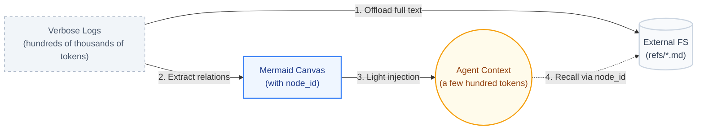

<div align="center">


### Agent Memory — internal hardening fork

[](./LICENSE)
[](https://nodejs.org/)
[](https://github.com/openclaw/openclaw)
[](https://hermes-agent.nousresearch.com/docs/)

[About This Fork](#about-this-fork) · [Security Changes](#what-this-fork-changed) · [Highlights](#-highlights) · [Architecture](#core-technology-reject-flat-storage-embrace-layering-and-symbolization) · [Quick Start](#quick-start)

<div align="center">

[**English**](./README.md) · [Upstream Chinese documentation](./README_CN.md)

</div>


</div>

---

## About this fork

This repository is a security-focused fork of
[TencentDB Agent Memory](https://github.com/Tencent/TencentDB-Agent-Memory), starting
from upstream commit `104e9d88588d506d1cd75cf7eb5957513319cad4`. It preserves
the upstream Git history and MIT license while establishing a separately
maintained codebase. It is not an official Tencent release and is not currently
published as a public npm package.

### What it really is

Agent Memory is a persistence and context-management component for AI agents.
It is not an agent orchestrator, authorization system, workflow engine, Slack
application, issue tracker, or source of truth for deployments and approvals.

It provides two main capabilities:

1. **Layered long-term memory.** It captures raw conversations (L0), extracts
   atomic facts (L1), groups those facts into scenario documents (L2), and
   periodically produces a higher-level persona or operating profile (L3).
2. **Short-term context offload.** It can move large tool results out of the
   active model context, preserve raw evidence in files, and represent task
   progress with compact Mermaid graphs linked back to that evidence.

The default storage backend is local SQLite. Memory extraction and
summarization still require an LLM, however, and embeddings, Tencent VectorDB,
remote offload, and proxy modes can make outbound network requests when an
operator configures them. **Local storage does not automatically mean zero
network egress.**

### What this fork changed

The first hardening pass made these behavioral changes:

| Area | Upstream behavior | Behavior in this fork |
| :--- | :--- | :--- |
| Package installation | A `postinstall` lifecycle hook could patch compiled OpenClaw runtime files. | The lifecycle hook was removed. Installing the package does not automatically modify OpenClaw or another package. |
| External tracing | Optional Opik support could transmit full prompts, messages, tool results, session identifiers, and model I/O. | The Opik dependency was removed and its initialization path is forced to a no-op. |
| Gateway authentication | Authentication was optional and an unset API key left non-health routes open. | Startup fails closed without an API key. `TDAI_GATEWAY_ALLOW_INSECURE_NO_AUTH=true` is an explicit escape hatch for isolated local development only. |
| Request size | JSON request bodies had no application-level size limit. | JSON bodies are limited to 2 MiB and oversized requests receive HTTP 413. |
| Error responses | Provider, filesystem, or internal errors could be returned to clients. | Unexpected failures return a generic HTTP 500 response while details remain in server logs. |
| Dependencies | Upstream did not commit an npm lockfile. | A lockfile is committed, CI installs with `npm ci --ignore-scripts`, and dependency auditing is a CI gate. |
| Package identity | Published upstream as `@tencentdb-agent-memory/memory-tencentdb`. | Renamed to `@internal/agent-memory`; replace this placeholder with the adopting company's internal registry scope. |
| Package contents | The runtime patch and offload setup script were included in the npm artifact. | Those two scripts are excluded from the artifact. They remain in source and upstream history pending repository minimization. |

The policy baseline is documented in
[`INTERNAL_SECURITY.md`](./INTERNAL_SECURITY.md).

### How it behaves now

- Installing dependencies does not run an Agent Memory install script.
- SQLite remains the default storage backend.
- Automatic capture, L0→L3 extraction, hybrid recall, OpenClaw integration,
  Hermes support, remote embeddings, Tencent VectorDB, and context offload
  otherwise retain their upstream behavior unless described above.
- Gateway clients must supply a valid Bearer token, except when the explicitly
  insecure local-development override is enabled.
- `GET /health` remains unauthenticated for orchestrator probes.
- Metrics reporting remains local logging when explicitly enabled.
- Memory is advisory and must never authorize a merge, deployment, access
  grant, destructive action, or other workflow transition.

### What is not cleaned up yet

This is a hardened fork, not yet a minimal fork. The repository still contains
upstream Hermes integrations, Tencent VectorDB support, migration/export
utilities, historical bugfix and runtime-patch scripts, duplicated Chinese
documentation and prompts, images, issue templates, and diagnostic tooling.
Most are not executed automatically, but they increase audit and maintenance
surface.

The following enterprise controls are also not yet enforced end-to-end:

- Slack workspace, tenant, repository, and work-item isolation in every stored
  record and query;
- outbound endpoint allow-listing;
- comprehensive secret and PII redaction before persistence and model calls;
- SBOM and third-party notice generation;
- signed commits and release artifacts;
- enterprise-specific English prompts and memory-poisoning defenses.

Until those items are completed, use one isolated deployment and storage root
per trust boundary, restrict network egress externally, and do not use this
fork for regulated, export-controlled, production-secret, or customer data.

### License and enterprise use

The project is licensed under MIT. The license permits commercial and internal
enterprise use, modification, redistribution, sublicensing, and sale, provided
the copyright and license notice are retained. Dependencies have their own
licenses and must be included in the adopting organization's normal open-source
compliance process. See [`LICENSE`](./LICENSE) and `package-lock.json` for exact
metadata. This README is operational guidance, not legal advice.

---

## ✨ Highlights

> **TencentDB Agent Memory = symbolic short-term memory + layered long-term memory.**
>
> - **Symbolic short-term memory** offloads heavy tool logs and condenses them into compact Mermaid symbols, cutting token usage and improving task success.
> - **Layered long-term memory** distills fragmented conversations into structured personas and scenes, instead of flat vector piles.

When integrated with OpenClaw, it cuts token usage by up to **61.38%**, improves pass rate by **51.52%** (relative), and raises PersonaMem accuracy from **48%** to **76%**.

> These are upstream benchmark claims. This fork has not independently
> reproduced or certified them; do not use them as an enterprise performance
> or security guarantee.

| Memory Capability | Benchmark | OpenClaw Success | With Plugin | Relative Δ | OpenClaw Tokens | With Plugin Tokens | Relative Δ |
| :--- | :--- | :---: | :---: | :---: | :---: | :---: | :---: |
| **Short-term** | WideSearch | 33% | **50%** | **+51.52%** | 221.31M | **85.64M** | **−61.38%** |
| **Short-term** | SWE-bench | 58.4% | **64.2%** | **+9.93%** | 3474.1M | **2375.4M** | **−33.09%** |
| **Short-term** | AA-LCR | 44.0% | **47.5%** | **+7.95%** | 112.0M | **77.3M** | **−30.98%** |
| **Long-term** | PersonaMem | 48% | **76%** | **+59%** | — | — | — |

> These results are measured over continuous long-horizon sessions, not isolated turns. For example, SWE-bench runs 50 consecutive tasks per session to simulate the context-accumulation pressure of real-world long-horizon agents.

---

## Overview

**Memory is not about hoarding everything in the AI — it is about sparing humans from having to repeat themselves.**

In practice, we constantly re-explain the same SOPs, project background, tool conventions, and output formats to the Agent. Such information should not require repetition, nor should it be indiscriminately dumped into the context.

TencentDB Agent Memory helps the Agent learn your workflows, retain task context, and reuse past experience. We reject both brute-force history accumulation and irreversible lossy summarization. Instead, we design memory as a layered system: **symbolic memory** for in-task information overload, and **memory layering** for cross-session experience.

> **Let the Agent remember what should be remembered, so people can focus on judgment, creation, and work that truly matters.**

---

## Core Technology: Reject Flat Storage, Embrace Layering and Symbolization

Our architecture rests on two pillars: **memory layering** and **symbolic memory**. Together they ensure Agents do not merely "remember more", but "reason better".

### 1. Memory Layering: Progressive Disclosure with Heterogeneous Storage

Traditional memory systems shred data into fragments and dump them into a flat vector store. Recall degenerates into a blind search across disconnected fragments, with no macro-level guidance.

Whether it is long-term knowledge, short-term tasks, or future skill capabilities, memory should never be flat — both its formation and its recall must be hierarchical. TencentDB Agent Memory adopts **layering** as its unified architectural paradigm:

*   **Short-term context layering.** The bottom layer archives raw tool outputs (`refs/*.md`); the middle layer extracts step-level summaries (`jsonl`); the top layer condenses state into a lightweight Mermaid canvas. The Agent only needs to attend to the top-layer structure in context, and drills down to the lower layers via `node_id` when an error occurs.
*   **Long-term personalization layering.** In place of flat logs, we build a semantic pyramid: **L0 Conversation** (raw dialogue) → **L1 Atom** (atomic facts) → **L2 Scenario** (scene blocks) → **L3 Persona** (user profile). The Persona layer carries day-to-day preferences; the system drills down to Atoms only when details matter.
*   **Skill generation layering.** Layering also applies to actions. The middle layer derives common solution patterns (**Scenario**) from bottom-layer execution traces (**Conversation**), and the top layer distills reusable Skills or standard SOPs (**Persona**).

<p align="center">
  
</p>

**Heterogeneous storage and progressive disclosure.** A dual-layer storage strategy underpins this architecture. The bottom layer (facts, logs, traces) is persisted in databases for robust full-text retrieval; the top layer (personas, scenes, canvases) is stored as human-readable Markdown files for high information density and white-box inspection. **Lower layers preserve evidence; upper layers preserve structure.**

**Full traceability and lossless recovery.** Compression often sacrifices traceability. TencentDB Agent Memory avoids irreversible compression by maintaining a deterministic path from high-level abstractions back to ground-truth evidence. Whether it is an offloaded error log or a distilled user preference, the system guarantees a complete drill-down path: "top-layer symbol (Persona / canvas) → mid-layer index (Scenario / jsonl) → bottom-layer raw text (L0 Conversation / refs)".

<div align="center">
  
</div>

### 2. Symbolic Memory: Maximum Semantics in Minimum Symbols (Mermaid Canvas)

In long tasks, the largest token consumers are verbose intermediate logs (search results, code, error traces). To address this, we combine **context offloading** with **symbolic memory**:

*   **Mermaid symbol graph.** Instead of verbose prose or flat JSON, we encode task state transitions in high-density Mermaid syntax — precise enough for LLMs to parse, concise enough for humans to read.
*   **History offloading.** Full tool logs are offloaded to external files; only a lightweight Mermaid task map remains in context.
*   **`node_id` tracing.** The Agent reasons over the symbol graph; to verify a detail, it greps for the `node_id` and instantly retrieves the full raw text — cutting token cost while preserving full traceability.



---

## Quick Start
## 🎬 Demos

<table align="center">
  <tr align="center" valign="middle">
    <td width="50%" valign="middle">
      <video src="https://github.com/user-attachments/assets/09c64a2c-9997-42c0-90a3-a15e250cfa43" controls="controls" muted="muted" style="max-width: 100%;"></video>
    </td>
    <td width="50%" valign="middle">
      <video src="https://github.com/user-attachments/assets/69045512-e75f-4c84-99dd-52ffa6e9e317" controls="controls" muted="muted" style="max-width: 100%;"></video>
    </td>
  </tr>
  <tr align="center" valign="top">
    <td>
      <em>OpenClaw × Agent Memory</em>
    </td>
    <td>
      <em>Hermes × Agent Memory</em>
    </td>
  </tr>
</table>

---


### 1. OpenClaw
### 1.1 Install the plugin

Do not install `@tencentdb-agent-memory/memory-tencentdb` when evaluating this
fork. That is the upstream public package and has different installation and
security behavior.

Build this reviewed commit with lifecycle scripts disabled:

```bash
npm ci --ignore-scripts
npm test
npm run build
npm pack --ignore-scripts
```

The resulting `internal-agent-memory-<version>.tgz` must be published to an
approved internal registry or installed through the adopting organization's
reviewed OpenClaw plugin process. Replace the placeholder `@internal` package
scope before publishing. Do not consume artifacts from an unreviewed upstream
release or branch.

### 1.2 Zero-config to enable

Defaults to a local `SQLite + sqlite-vec` backend.

```jsonc
// ~/.openclaw/openclaw.json
{
  "memory-tencentdb": {
    "enabled": true
  }
}
```

Once enabled, TencentDB Agent Memory automatically handles conversation capture, memory extraction, scene aggregation, persona generation, and recall before the next turn.

### 1.3 Enable short-term compression (optional, requires version ≥ 0.3.4)

```jsonc
{
  "memory-tencentdb": {
    "config": {
      "offload": {
        "enabled": true
      }
    }
  }
}
```

#### Step 1 — Register the slot in your plugin config

Add the `slots` field so OpenClaw routes context-offload requests to this plugin:

```jsonc
{
  "plugins": {
    "slots": {
      "contextEngine": "memory-tencentdb"
    }
  }
}
```

#### Step 2 — Runtime patch status in this fork

The internal package no longer runs or ships the upstream runtime patch as an
automatic installation action. The upstream script remains in the source tree
for provenance and review, but it is not approved for production use in this
fork. Context-offload features that depend on patched `after-tool-call` message
access are unsupported until integrated through a reviewed, stable host API.

Do not add this patch back to `postinstall` or apply it automatically to an
OpenClaw installation.


### 2. Hermes

In addition to OpenClaw, this plugin also supports [Hermes](https://github.com/NousResearch/hermes-agent) Agent. Choose the installation path based on your deployment scenario:

| You want to … | Use |
|---|---|
| Spin up a memory-enabled Hermes from scratch in one command | 2.A Docker (below) |
| Add memory to an existing Hermes install | 2.B Plug into an existing Hermes (next section) |

#### 2.A Docker (greenfield, requires version ≥ 0.3.4)

The Docker image bundles `hermes-agent` and the `memory_tencentdb` provider together. The Gateway listens on `:8420`:

```bash
# ============ Configuration Parameters ============
# MODEL_API_KEY    LLM API key (required) — replace with your own credential
# MODEL_BASE_URL   Company-approved OpenAI-compatible LLM endpoint (required)
# MODEL_NAME       Model name, defaults to DeepSeek-V3.2
# MODEL_PROVIDER   Provider type: "custom" works for any OpenAI-compatible endpoint

MODEL_API_KEY="your-api-key"
MODEL_BASE_URL="https://llm.example.internal/v1"
MODEL_NAME="deepseek-v3.2"
MODEL_PROVIDER="custom"

# ============ docker run Flags ============
# -d                          Run container in detached (background) mode
# --name hermes-memory        Container name, for later docker exec / logs / stop
# --restart unless-stopped    Auto-restart on crash or host reboot
# -p 8420:8420                Host port ↔ container port (Hermes Gateway)
# -e MODEL_*                  Inject the config parameters above as env vars
# -v hermes_data:/opt/data    Persist memory data to a named volume (survives restart)

# Enter the Docker build directory (already cloned the repo and at the repo root)
cd docker/opensource

# Build
docker build -f Dockerfile.hermes -t hermes-memory .

# Run
docker run -d \
  --name hermes-memory \
  --restart unless-stopped \
  -p 8420:8420 \
  -e MODEL_API_KEY="your-api-key" \
  -e MODEL_BASE_URL="https://llm.example.internal/v1" \
  -e MODEL_NAME="deepseek-v3.2" \
  -e MODEL_PROVIDER="custom" \
  -v hermes_data:/opt/data \
  hermes-memory

# Verify the Gateway
curl http://localhost:8420/health

# Enter the Hermes interactive shell
docker exec -it hermes-memory hermes
```

> The image ships with Tencent Cloud DeepSeek-V3.2 as the default. If you use this model, omit `MODEL_BASE_URL` / `MODEL_NAME` / `MODEL_PROVIDER` and pass only `MODEL_API_KEY`.

#### 2.B Attach to Existing Hermes (No Docker)

If you already have `hermes-agent` installed on your host and just want to add memory capabilities, **no Docker image is needed**.

**1. Download the plugin package to a unified directory**:

```bash
mkdir -p ~/.memory-tencentdb
TEMP_DIR=$(mktemp -d)
cd "$TEMP_DIR"
npm init -y --silent
npm install @tencentdb-agent-memory/memory-tencentdb@latest --omit=dev
cp -r node_modules/@tencentdb-agent-memory/memory-tencentdb \
      ~/.memory-tencentdb/tdai-memory-openclaw-plugin
rm -rf "$TEMP_DIR"
```

**2. Install Gateway dependencies**:

```bash
cd ~/.memory-tencentdb/tdai-memory-openclaw-plugin
npm install --omit=dev
npm install tsx
```

**3. Link to the Hermes plugin directory**:

```bash
rm -rf ~/.hermes/hermes-agent/plugins/memory/memory_tencentdb
ln -sf ~/.memory-tencentdb/tdai-memory-openclaw-plugin/hermes-plugin/memory/memory_tencentdb \
       ~/.hermes/hermes-agent/plugins/memory/memory_tencentdb
```

> The directory **must** be named `memory_tencentdb` (with an underscore) — Hermes uses this as the provider key. `memory-tencentdb` (with a hyphen) is only an alias at the config level and **cannot** be used as the directory name.

**4. Declare the provider in `~/.hermes/config.yaml`**:

```yaml
memory:
  provider: memory_tencentdb
```

**5. Configure Gateway environment variables**

Edit `~/.hermes/.env` and add:

```bash
MEMORY_TENCENTDB_GATEWAY_CMD="sh -c 'cd ~/.memory-tencentdb/tdai-memory-openclaw-plugin && exec npx tsx src/gateway/server.ts'"
MEMORY_TENCENTDB_GATEWAY_HOST="127.0.0.1"
MEMORY_TENCENTDB_GATEWAY_PORT="8420"
```

Add LLM credentials as needed (the Gateway actually reads the `TDAI_LLM_*` variables):

```bash
TDAI_LLM_API_KEY="sk-your-api-key-here"
TDAI_LLM_BASE_URL="https://api.openai.com/v1"
TDAI_LLM_MODEL="gpt-4o"
```

Alternatively, use a Gateway config file at `~/.memory-tencentdb/memory-tdai/tdai-gateway.json`:

```json
{
  "llm": {
    "baseUrl": "https://your-api-endpoint/v1",
    "apiKey": "your-api-key",
    "model": "your-model-name"
  }
}
```

**6. Start the Gateway** (choose one of two methods):

- **Auto-discovery on conversation (recommended, zero-config)**: Don't start the Gateway manually — just start talking to Hermes. The provider will auto-detect `~/.memory-tencentdb/tdai-memory-openclaw-plugin/src/gateway/server.ts` and launch it via `Popen()` on the first conversation. The initial conversation may have a slight delay.
- **Manual run**: Start a standalone Gateway process in advance:
  ```bash
  cd ~/.memory-tencentdb/tdai-memory-openclaw-plugin
  npx tsx src/gateway/server.ts
  ```

**7. Verify**:

```bash
curl http://127.0.0.1:8420/health
# Should return {"status":"ok"} or {"status":"degraded"}
```

> For the complete provider reference (environment variables, troubleshooting, LLM tool schemas, supervisor behavior), see [`hermes-plugin/memory/memory_tencentdb/README.md`](./hermes-plugin/memory/memory_tencentdb/README.md). Please read it before adjusting the supervisor / circuit-breaker defaults.


---

### 3. Hermes (Windows native)

For a Windows-native Hermes install, run the bundled batch script from the
repository root in Command Prompt or PowerShell:

```powershell
$env:TDAI_LLM_API_KEY="your-api-key"
$env:TDAI_LLM_BASE_URL="https://api.openai.com/v1"
$env:TDAI_LLM_MODEL="gpt-4o"
.\scripts\setup-hermes-memory-tencentdb.bat
```

The script checks `node`, `npm`, Python, and Hermes, requires Node.js
`>=22.16.0`, runs `npm install --omit=dev` when Gateway dependencies are
missing, creates `%USERPROFILE%\.memory-tencentdb\memory-tdai`, copies the
provider to `%USERPROFILE%\.hermes\plugins\memory_tencentdb`, writes Gateway
environment variables to `%USERPROFILE%\.hermes\.env`, and starts the Gateway
before polling:

```powershell
curl.exe http://127.0.0.1:8420/health
```

If `%USERPROFILE%\.hermes\config.yaml` already exists, make sure it contains:

```yaml
memory:
  provider: memory_tencentdb
```


## 🔒 Gateway security

The Hermes Gateway listens on `:8420` and exposes capture, search, and recall
HTTP endpoints. This fork requires authentication before opening a listener.

| Field | env | Default | Description |
| :--- | :--- | :--- | :--- |
| `server.apiKey` | `TDAI_GATEWAY_API_KEY` | _(required)_ | Every route except `GET /health` requires `Authorization: Bearer <apiKey>`; missing or wrong tokens get HTTP 401. Comparison is constant-time. |
| `server.allowInsecureNoAuth` | `TDAI_GATEWAY_ALLOW_INSECURE_NO_AUTH` | `false` | Explicitly permits unauthenticated startup. Use only for isolated local development. |
| `server.corsOrigins` | `TDAI_CORS_ORIGINS` (comma-separated) | `[]` | CORS allow-list. Empty list emits **no** `Access-Control-Allow-*` headers — browsers then block all cross-origin requests. Use `["*"]` only for local development. |

When the API key is unset, startup fails unless the insecure override is
explicitly enabled. When that override is active, the Gateway emits prominent
warnings and must not be exposed outside a trusted local environment.

Clients call protected routes with a Bearer token:

```bash
curl -H "Authorization: Bearer $TDAI_GATEWAY_API_KEY" \
     -H "Content-Type: application/json" \
     -d '{"query":"...","session_key":"..."}' \
     http://127.0.0.1:8420/recall
```

`GET /health` stays open without a token so orchestrator probes (`docker healthcheck`, `kubectl liveness`) keep working.

### Hermes plugin side

The Hermes `memory_tencentdb` plugin is a **client** of the Gateway. To make it talk to a Gateway that has auth enabled, set:

```bash
export MEMORY_TENCENTDB_GATEWAY_API_KEY="<same-secret-as-gateway>"
```

The plugin attaches `Authorization: Bearer <key>` to every request it sends to
the Gateway. If the variable is unset, it sends no auth header and protected
Gateway requests will be rejected.

Important: the plugin only handles the **client half**. Whether the Gateway actually enforces a Bearer check is decided on the Gateway side (`TDAI_GATEWAY_API_KEY` / `server.apiKey`). Configure the same secret on both ends — the plugin does not propagate the secret across, since the Gateway might be started by Docker, systemd, or any other means outside the plugin's control.

If `MEMORY_TENCENTDB_GATEWAY_API_KEY` is unset, the plugin also looks at `TDAI_GATEWAY_API_KEY` as a fallback — handy when both processes share an env file and the operator only wants to set one variable name. The Gateway never reads `MEMORY_TENCENTDB_GATEWAY_API_KEY`; that name is plugin-side only.

---


## 🔧 Configurable Parameters

The OpenClaw plugin retains upstream defaults for most fields. The standalone
Gateway is intentionally not zero-configuration in this fork: it requires an
API key unless the explicit insecure local-development override is enabled.
Review all outbound endpoint settings before deployment.

<details>
<summary><b>🟢 Level 1 · Daily tuning</b> (covers 90% of use cases)</summary>

| Field | Default | Description |
| :--- | :--- | :--- |
| `timezone` | `"system"` | Timezone for user/LLM-facing timestamps: `"system"` (follow process tz) / IANA name (`Asia/Shanghai`) / offset string (`+08:00`) |
| `storeBackend` | `"sqlite"` | Storage backend: `sqlite` |
| `recall.strategy` | `"hybrid"` | Recall strategy: `keyword` / `embedding` / `hybrid` (RRF fusion, recommended) |
| `recall.maxResults` | `5` | Number of items returned per recall |
| `recall.maxCharsPerMemory` | `0` | Max characters injected for one recalled L1 memory; `0` disables this guard |
| `recall.maxTotalRecallChars` | `0` | Total character budget for auto-recalled L1 memories; `0` disables this guard |
| `pipeline.everyNConversations` | `5` | Trigger an L1 memory extraction every N turns |
| `extraction.maxMemoriesPerSession` | `20` | Max memories extracted per L1 pass |
| `persona.triggerEveryN` | `50` | Generate the user persona every N new memories |
| `offload.enabled` | `false` | Whether to enable short-term compression |

</details>

<details>
<summary><b>🟡 Level 2 · Advanced tuning</b> (long task / long session)</summary>

| Field | Default | Description |
| :--- | :--- | :--- |
| `pipeline.enableWarmup` | `true` | Warm-up: a new session triggers from turn 1, doubling each time up to N (1→2→4→…) |
| `pipeline.l1IdleTimeoutSeconds` | `600` | Trigger L1 after the user has been idle for this many seconds |
| `pipeline.l2MinIntervalSeconds` | `900` | Minimum interval between two L2 passes within the same session |
| `recall.timeoutMs` | `5000` | Recall timeout; on timeout, skip injection without blocking the conversation |
| `extraction.enableDedup` | `true` | L1 vector dedup / conflict detection |
| `capture.excludeAgents` | `[]` | Glob patterns to exclude specific agents (e.g. `bench-judge-*`) |
| `capture.l0l1RetentionDays` | `0` | Local retention days for L0 / L1 files; `0` = never clean up |
| `offload.mildOffloadRatio` | `0.5` | Mild compression trigger ratio (of context window) |
| `offload.aggressiveCompressRatio` | `0.85` | Aggressive compression trigger ratio |
| `offload.mmdMaxTokenRatio` | `0.2` | Token budget ratio for MMD injection |
| `bm25.language` | `"zh"` | Tokenizer language: `zh` (jieba) / `en` |

</details>

<details>
<summary><b>🔴 Level 3 · Full parameter reference</b> (ops / custom models / remote embedding)</summary>

For all fields, types, and constraints see [`openclaw.plugin.json`](./openclaw.plugin.json)。

- `embedding.*` — remote embedding service (OpenAI-compatible API)
  - `embedding.sendDimensions` (default `true`): whether to include the `dimensions` field in the request body. OpenAI `text-embedding-3-*` models rely on it for Matryoshka truncation, but some self-hosted / OSS models (e.g. **BGE-M3**) do not support custom dimensions and will reject the request with HTTP 400 `does not support matryoshka representation`. Set it to `false` for those backends, e.g.:
    ```json
    {
      "embedding": {
        "enabled": true,
        "provider": "openai",
        "baseUrl": "http://your-host:your-port/v1",
        "apiKey": "<KEY>",
        "model": "bge-m3",
        "dimensions": 1024,
        "sendDimensions": false
      }
    }
    ```
- `llm.*` — standalone LLM mode (bypass OpenClaw's built-in model and run L1/L2/L3 with a designated API)
- `offload.backendUrl / backendApiKey` — offload the L1/L1.5/L2/L4 flow to a backend service
- `report.*` — metrics reporting

</details>

---

## 🤔 Features

### 1. Macro Personas + Micro Facts: A Unified Drill-Down Mechanism

The biggest risk in compression is saving tokens at the cost of losing the evidence. TencentDB Agent Memory therefore does not collapse history into an irreversible summary — it preserves a clear path from high-level abstraction back to ground-truth evidence.

| Question type | First look at | Drill down to |
| :--- | :--- | :--- |
| Daily preferences, voice, long-term goals | L3 Persona / L2 Scenario | L1 Atom / L0 Conversation when facts are needed |
| Specific facts, dates, project details | L1 Atom / L0 Conversation | Widen the time range, or fall back to semantic recall when results are sparse |
| Continuing a long-running task | Active Mermaid task canvas | Check the JSONL when the summary lacks detail, then `refs/*.md` for raw text |
| Resuming a historical task | Metadata task entry | Open the Mermaid canvas → locate the `node_id` → trace `result_ref` |

The upper layers carry judgment and direction; the lower layers carry evidence and precision. Short-term compression and long-term memory form a single closed loop: **collapsible and expandable, abstract yet auditable.**

### 2. White-Box Debuggability: Memory Is Not a Black Box

Most memory systems fall short here: when recall is wrong, all you see is a list of vector scores, with no way to tell where things went wrong. TencentDB Agent Memory keeps the key intermediates as readable files:

- L2 Scenario blocks are plain Markdown — open them and inspect.
- L3 Persona lives in `persona.md` and traces back to the Scenarios that produced it.
- Short-term task canvases are Mermaid — readable by both humans and Agents.
- Raw payloads, summaries, and nodes are linked by `result_ref` and `node_id`.

Debugging no longer means probing an opaque database — it becomes a deterministic walk along the chain "Persona → Scenario → Atom → Conversation" until the root cause surfaces.

**All of these layered memory artifacts live under `~/.openclaw/memory-tdai/` — feel free to open the directory and inspect each layer for yourself.**

### 3. Upstream integration capabilities

| Capability | Description |
| :--- | :--- |
| OpenClaw plugin | Automatically captures, extracts, and recalls memory once installed |
| Hermes Gateway adapter | `TdaiCore + HostAdapter`, decoupled from the host framework |
| Local backend | `SQLite + sqlite-vec`, ready to use out of the box |
| Hybrid retrieval | BM25 + vector + RRF — supports both keyword and semantic recall |
| Agent tools | `tdai_memory_search` / `tdai_conversation_search` |

---

## Documentation

| Document | Contents |
| :--- | :--- |
| [`scripts/README.memory-tencentdb-ctl.md`](./scripts/README.memory-tencentdb-ctl.md) | Operations & management tooling |
| [`CHANGELOG.md`](./CHANGELOG.md) | Release notes and version history |
| [`openclaw.plugin.json`](./openclaw.plugin.json) | OpenClaw plugin manifest and configuration schema |

---

## Community & Contributing

We welcome every kind of contribution — bug reports, feature ideas, doc fixes, benchmark reproductions, ecosystem integrations, or a Pull Request. Agent memory is far from a solved problem, and we'd love to figure it out together.

- 🐞 **Found a bug or have a question?** Open an issue at [GitHub Issues](https://github.com/Tencent/TencentDB-Agent-Memory/issues) — we respond within 24 hours.
- 💡 **Have an idea to share?** Start a thread in [GitHub Discussions](https://github.com/Tencent/TencentDB-Agent-Memory/discussions).
- 🛠️ **Want to contribute code?** Please read [CONTRIBUTING.md](./CONTRIBUTING.md) first.
- 💬 **Want to chat with us?** Join our [Discord community](https://discord.gg/dJQM6mKMF) and talk to the early developers directly.

---

## Roadmap

- [x] Long-term personalized memory (L0 → L3)
- [x] Short-term context compression (Context Offload + Mermaid canvas)
- [x] Local SQLite backend and Tencent Cloud Vector Database (TCVDB) backend
- [x] OpenClaw plugin and Hermes Gateway integration
- [ ] Portable memory: cross-Agent / cross-framework / cross-device import, export, and live migration
- [ ] Automatic Skill generation
- [ ] Visual debugging and memory observability dashboard

---

<table>
  <tr>
    <td width="68%">
      <b>If TencentDB Agent Memory has been useful to you, please give the project a ⭐ to support us.</b><br />
      For any suggestions, feel free to open an issue and start the discussion.
    </td>
    <td width="32%" align="right">
      
    </td>
  </tr>
</table>

[MIT](./LICENSE) © TencentDB Agent Memory Team
